# A Proof of Conway’s Refinement Conjecture

50 years ago, in his book *On Numbers and Games*, John Conway proposed a conjecture:


He claims that if $a,b,c,d\in\mathbf{Oz}$ and $ab=cd$, then there are $e,f,g,h\in\mathbf{Oz}$ such that $a=ef$, $b=gh$, $c=eg$, and $d=fh$.

(If you're not familiar with omnific integers aka $\mathbf{Oz}$, I briefly describe them at the bottom.)

I believe that this repository contains a [proof](https://github.com/gaearon/conway-refinement/blob/main/ConwayRefinement/Standalone/CombinatorialGames/ConwayRefinementProof.lean) of this conjecture, which you can explore through its [proof map](https://gaearon.github.io/conway-refinement/#/map/conway-refinement).

## About this proof

This proof was obtained in a somewhat unusual way.

I am not a mathematician, but I have an amateur level of interest in mathematics. Initially, after seeing all the recent headlines, I wanted to try an "AI proof" as an experiment. I asked Claude to pick an open problem about [surreal numbers](https://www.infinitelymore.xyz/p/surreal-numbers), a strange and beautiful invention (discovery?) of John Conway. Claude suggested this little conjecture because Sonia L'Innocente and Vincenzo Mantova had [recently made some progress toward it](https://www.sciencedirect.com/science/article/pii/S0001870824000288), so new pathways might have become available.

I couldn't "one-shot" the conjecture with AI, but this only got me more interested. I started wondering whether it was possible to make some progress if I steered the AI in some particular way. I would also have to figure out some way to know if I've actually made any progress, or if it's feeding me hallucinations. I thought it was funny and considerably absurd that I'm trying to do this without actually understanding the space, and I've limited my mathematical inquest to understanding what the *statement* says, but not anything about its proof methods.

Over the course of the last month, I've spent all my free time on it, repeatedly maxed out my 20x Pro usage for [ChatGPT](https://chatgpt.com/) and [Claude](https://claude.ai/) to generate potential "ideas" and then steered the AI into writing [Lean](https://lean-lang.org/) to sort out which of these ideas "agree" with acceptable mathematics.

This is probably why this proof ended up so long and confusing.

## Why I think it's correct

As anyone who's tried to prove things with Lean knows, there are two main dangers:

1. You may transitively [rely on bad axioms](https://overreacted.io/the-math-is-haunted/) or `sorry`s.
2. You may have proven a different statement than you intended.

To protect myself against these two dangers, I have taken two precautions.

### The CombinatorialGames formulation

The harder question is whether the Lean statement actually says what Conway's conjecture says. To make this easier to check, I put the statement in a standalone file with as little of "my" code as possible. [`ConwayRefinement.lean`](ConwayRefinement/Standalone/CombinatorialGames/ConwayRefinement.lean) uses only `Surreal` from [CombinatorialGames](https://github.com/vihdzp/combinatorial-games):

```lean
import CombinatorialGames.Surreal.Multiplication

universe u

/-- `x` is an omnific integer when it is the cut with
sole left option `x - 1` and sole right option `x + 1`. -/
abbrev IsConwayOmnificInteger (x : Surreal.{u}) : Prop :=
  x = !{{x - 1} | {x + 1}}' (by
    simp only [Set.mem_singleton_iff]
    rintro _ rfl _ rfl
    simp [sub_eq_add_neg])

/-- Conjecture: Every equality `a * b = c * d` of omnific integers
has an omnific refinement `a = e * f`, `b = g * h`, `c = e * g`, `d = f * h`. -/
abbrev ConwayConjecture : Prop :=
  ∀ a b c d : Surreal.{u},
    IsConwayOmnificInteger a → IsConwayOmnificInteger b →
    IsConwayOmnificInteger c → IsConwayOmnificInteger d → a * b = c * d →
    ∃ e f g h : Surreal.{u},
      IsConwayOmnificInteger e ∧ IsConwayOmnificInteger f ∧
      IsConwayOmnificInteger g ∧ IsConwayOmnificInteger h ∧
      a = e * f ∧ b = g * h ∧ c = e * g ∧ d = f * h
```

Then I offer a proof of exactly that statement in [`ConwayRefinementProof.lean`](ConwayRefinement/Standalone/CombinatorialGames/ConwayRefinementProof.lean):

```lean
theorem proof : ConwayConjecture.{u} := by
  -- ...

#print axioms proof
```

which prints:

```text
'ConwayConjecture.proof' depends on axioms: [propext, Classical.choice, Quot.sound]
```

*(CI also runs a linter [inspired by TauCeti](https://github.com/TauCetiProject/TauCeti/blob/main/scripts/Axioms.lean) that bans all other axioms from the entire project.)*

### The Mathlib-only formulation

Of course, you might not want to take the `Surreal` definition from CombinatorialGames on faith, so I also have a [Mathlib](https://github.com/leanprover-community/mathlib4)-only formulation in [`InlineConwayRefinement.lean`](ConwayRefinement/Standalone/Mathlib/InlineConwayRefinement.lean). It inlines every necessary definition from [CombinatorialGames](https://github.com/vihdzp/combinatorial-games/) into a ~250-line file.

The corresponding proof is in [`InlineConwayRefinementProof.lean`](ConwayRefinement/Standalone/Mathlib/InlineConwayRefinementProof.lean). It reports the same three axioms: `propext`, `Classical.choice`, and `Quot.sound`.

It is still quite possible that one or both of these statements do not correspond to Conway's conjecture in some small or big way, in which case this would not be a valid mathematical proof no matter what Lean says about it.

## Navigating the proof

While the above approach gave me some confidence in the validity of the proof, I am sure it is needlessly complicated and poorly explained. I've experimented with different ways to nudge the models into writing clearer mathematics, but it was difficult to get them to reliably write using standard terms, or to separate the core of the argument from bookkeeping or long detours that got fossilized in Lean.

Initially, I tried to generate a "paper". Eventually, I switched to [a proof guide website](https://gaearon.github.io/conway-refinement/), which is closer to what this project actually is. The website has AI-written descriptions of some Lean theorems that contribute to the top-level result. AI also chose which theorems to include. The tooling verifies that each numbered result actually corresponds to a checked piece of Lean code:


Inside these snippets, you can Cmd/Ctrl+Click any Lean identifier to open its source code on GitHub. For each selected theorem, you can step through the captured proof state at every character to retrace that part of the proof:

https://github.com/user-attachments/assets/04a4d2e8-913b-496c-95f2-b0decdec8811

The mathematical prose summarizing each Lean proof is written by AI and may contain mistakes. (There's an edit button if you'd like to contribute a fix.) I welcome pull requests that refine which theorems are selected for the website, or improve their factoring.

You can also select any result and see its "proof map", which traces its dependencies and consequences:


I thought this might help a mathematical reader make some sense of the AI's argument. If you can propose a more direct path, please open an issue or a pull request. I would be happy to delete any uninteresting intermediate results, to factor the results differently, or to try another path as long as your proposal compiles or AI can get it to compile. If there is a better route, I can merge it and regenerate the proof map.

The [interactive guide](https://gaearon.github.io/conway-refinement/) is also available in [PDF form](https://gaearon.github.io/conway-refinement/blueprint.pdf), which you can save offline. Source code links inside them are versioned and link to the commit that they were built from.

If the result is correct, it might eventually be useful to cite it. I don't think the proof in this repository is in an acceptable state for that yet, but hopefully putting it out will either build confidence in the Lean result or debunk it. I also hope it serves as an example of another AI-driven experiment in proof exploration. I don't consider this completed mathematical work.

## Formalized results

The proof guide has a lot of intermediate steps. This is a shorter list of results and examples that I think are worth looking at. It includes every result from the guide's [Highlights page](https://gaearon.github.io/conway-refinement/#/highlights).

Each standalone statement is paired with a proof file. Each map shows how the result depends on the rest of the proof. Only Lean declarations explicitly annotated for the proof guide appear in these maps.

### The headline claim

| Formulation | Links |
|---|---|
| CombinatorialGames formulation of Conway's refinement conjecture | [statement](ConwayRefinement/Standalone/CombinatorialGames/ConwayRefinement.lean), [proof](ConwayRefinement/Standalone/CombinatorialGames/ConwayRefinementProof.lean), [map](https://gaearon.github.io/conway-refinement/#/map/conway-refinement) |
| Mathlib-only formulation of Conway's refinement conjecture | [statement](ConwayRefinement/Standalone/Mathlib/InlineConwayRefinement.lean), [proof](ConwayRefinement/Standalone/Mathlib/InlineConwayRefinementProof.lean), [map](https://gaearon.github.io/conway-refinement/#/map/conway-refinement) |

### Standalone statements over Mathlib

Each statement file in this table imports only Mathlib. Its paired proof connects it to the rest of the proof.

| Result | Links |
|---|---|
| Four-factor refinement in saturated Hahn integer parts with integer constants | [statement](ConwayRefinement/Standalone/Mathlib/HahnIntegerPartRefinement.lean), [proof](ConwayRefinement/Standalone/Mathlib/HahnIntegerPartRefinementProof.lean), [map](https://gaearon.github.io/conway-refinement/#/map/integer-hahn-refinement-of-saturation) |
| Polynomial presentation and four-factor refinement of Hahn germ rings over Cauchy-complete exponent groups | [statement](ConwayRefinement/Standalone/Mathlib/CompleteHahnGerm.lean), [proof](ConwayRefinement/Standalone/Mathlib/CompleteHahnGermProof.lean), [map](https://gaearon.github.io/conway-refinement/#/map/complete-hahn-germ-refinement) |
| Polynomial presentation of $K((\mathbb R^{\le 0}))$ over its finite-support subring | [statement](ConwayRefinement/Standalone/Mathlib/HahnSeriesPolynomialRing.lean), [proof](ConwayRefinement/Standalone/Mathlib/HahnSeriesPolynomialRingProof.lean), [map](https://gaearon.github.io/conway-refinement/#/map/hahn-series-polynomial-algebra) |
| GCDs, every series primal, irreducibles prime, and uniqueness of irreducible factorisations in $K((\mathbb R^{\le 0}))$ | [statement](ConwayRefinement/Standalone/Mathlib/HahnSeriesGCD.lean), [proof](ConwayRefinement/Standalone/Mathlib/HahnSeriesGCDProof.lean), [map](https://gaearon.github.io/conway-refinement/#/map/hahn-series-gcd-domain) |
| Berarducci's germ ring is a polynomial ring and a UFD | [statement](ConwayRefinement/Standalone/Mathlib/GermPolynomialRing.lean), [proof](ConwayRefinement/Standalone/Mathlib/GermPolynomialRingProof.lean), [map](https://gaearon.github.io/conway-refinement/#/map/ordinal-value-quotient) |
| An explicit degree-two prime in $K((\mathbb R^{\le 0}))$ | [statement](ConwayRefinement/Standalone/Mathlib/Examples/DegreeTwoPrime.lean), [proof](ConwayRefinement/Standalone/Mathlib/Examples/DegreeTwoPrimeProof.lean), [map](https://gaearon.github.io/conway-refinement/#/map/degree-two-series-prime) |

### A standalone statement over Mathlib and CombinatorialGames

| Result | Links |
|---|---|
| Minimal homogeneous families in $\widehat{\mathrm P}$ are algebraically independent | [statement](ConwayRefinement/Standalone/CombinatorialGames/PrincipalRVAlgebraicIndependence.lean), [proof](ConwayRefinement/Standalone/CombinatorialGames/PrincipalRVAlgebraicIndependenceProof.lean), [map](https://gaearon.github.io/conway-refinement/#/map/polynomial) |

### Other results and examples

These also have short statement and proof files, but their statements use code from this repository.

| Result | Links |
|---|---|
| General conditions guaranteeing Conway's four-factor property for certain rings of infinite series | [statement](ConwayRefinement/Standalone/Mathlib/Examples/HahnIntegerPartRefinementCriterion.lean), [proof](ConwayRefinement/Standalone/Mathlib/Examples/HahnIntegerPartRefinementCriterionProof.lean), [map](https://gaearon.github.io/conway-refinement/#/map/hahn-integer-part-refinement) |
| Normal-form identification, every omnific integer primal, irreducibles prime, and uniqueness of irreducible factorisations in $\mathbf{Oz}$ | [statement](ConwayRefinement/Standalone/CombinatorialGames/Examples/OmnificFactorization.lean), [proof](ConwayRefinement/Standalone/CombinatorialGames/Examples/OmnificFactorizationProof.lean), [map](https://gaearon.github.io/conway-refinement/#/map/omnific-factorisation) |
| An explicit degree-two prime in $\mathbf{Oz}$, with a coefficient-doubled foil of the same support order type that factors nontrivially | [statement](ConwayRefinement/Standalone/CombinatorialGames/Examples/DegreeTwoPrime.lean), [proof](ConwayRefinement/Standalone/CombinatorialGames/Examples/DegreeTwoPrimeProof.lean), [map](https://gaearon.github.io/conway-refinement/#/map/explicit-omnific-prime) |
| Conway's one-row prime in $\mathbf{Oz}$ | [statement](ConwayRefinement/Standalone/CombinatorialGames/Examples/OneRowPrime.lean), [proof](ConwayRefinement/Standalone/CombinatorialGames/Examples/OneRowPrimeProof.lean), [map](https://gaearon.github.io/conway-refinement/#/map/omnific-factorisation) |

Conway's one-row prime is a concrete example of the general theorem about omnific integers above, so both link to the same proof map.

### Results without separate statement files

These results don't have separate standalone statement files, but AI chose them as useful on their own or especially important to the proof.

| Result | Links |
|---|---|
| Multiplicativity of the Cantor–Bendixson value | [source](ConwayRefinement/HahnSeries/Germ/AlgebraicIndependence/CantorBendixsonValueMultiplicativity.lean), [map](https://gaearon.github.io/conway-refinement/#/map/cantor-bendixson-value-multiplicative) |
| Algebraic independence in the Cantor–Bendixson associated graded ring | [source](ConwayRefinement/HahnSeries/Germ/AlgebraicIndependence/AlgebraicIndependence.lean), [map](https://gaearon.github.io/conway-refinement/#/map/cantor-bendixson-minimal-generators-independent) |
| Random series of finite Cantor degree, and their lower-order perturbations, are prime | [source](ConwayRefinement/HahnSeries/Primality/Random.lean), [map](https://gaearon.github.io/conway-refinement/#/map/random-series-prime) |
| Every reduced nonordinary omnific integer is primal | [source](ConwayRefinement/Surreal/OmnificInteger/Primality/OmnificIntegers.lean), [map](https://gaearon.github.io/conway-refinement/#/map/reduced-omnific-primal) |
| Refinement of $Z+K((G^{<0}))$ forces $K=\mathrm{Frac}(Z)$ | [source](ConwayRefinement/HahnSeries/IntegerPart/Refinement/TruncationIntegerPartFractionField.lean), [map](https://gaearon.github.io/conway-refinement/#/map/refinement-forces-coefficient-fraction-field) |

Please open an issue if any of these are wrong or could be clearer.

## Proof maps

The proof map on the website is based on a dependency graph from specially marked theorems. I originally used [LeanArchitect](https://github.com/hanwenzhu/LeanArchitect) and [subverso](https://github.com/leanprover/subverso), but ended up slopforking both, so the tooling for the site is currently custom.

I also have a script that turns the proof map into the Mermaid diagrams below:

<!-- blueprint-mermaid:start -->
### Proof overview

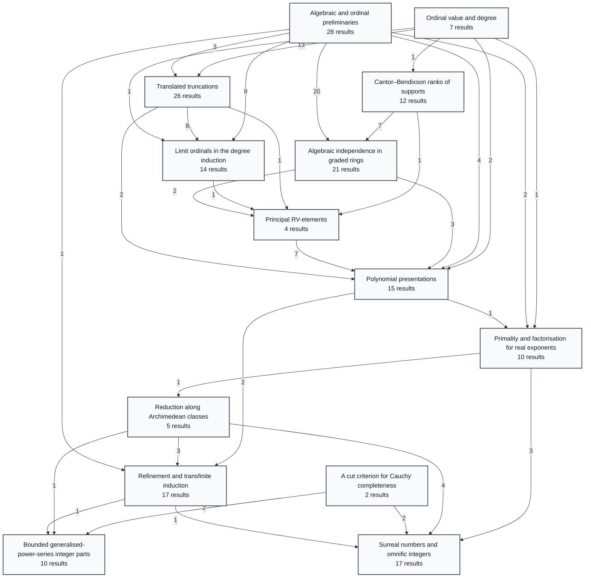

<a id="phase-preliminaries"></a>
<details>
<summary>Algebraic and ordinal preliminaries</summary>

```mermaid
%% Generated by scripts/blueprint.sh; do not edit.
%% Other sections are compressed to boundary nodes.
%% Solid arrows are proof dependencies; dashed arrows are statement dependencies.
flowchart TB
  subgraph current["Algebraic and ordinal preliminaries"]
    direction TB
    n001["(1) A primal zero-residue element forces the fraction-field condition"]:::lemma
    n002["(2) Extension of a degreewise independent family"]:::lemma
    n003["(3) Homogeneous decomposition in a finitely generated graded ideal"]:::lemma
    n004["(4) Weighted-homogeneous polynomial representatives"]:::lemma
    n005["(5) Linear part of a weighted-homogeneous polynomial"]:::lemma
    n006["(6) Vanishing of the linear part of a homogeneous relation"]:::lemma
    n007["(7) Weights of variables in a homogeneous relation"]:::lemma
    n008["(8) Weighted Euler decomposition at the ω^0 coefficient"]:::lemma
    n009["(9) Partial-derivative decomposition of a homogeneous ideal relation"]:::lemma
    n010["(10) Greatest common divisors in multivariate polynomial rings"]:::lemma
    n011["(11) Partial-derivative obstruction to a linear variable"]:::lemma
    n012["(12) Vanishing criterion for partial derivatives of weighted-homogeneous polynomials"]:::lemma
    n013["(13) Weighted degree of polynomial derivations"]:::lemma
    n014["(14) Weighted Euler identity"]:::lemma
    n015["(15) Finite generation of polynomial syzygies"]:::lemma
    n016["(16) Lifting generation from the associated graded ring"]:::lemma
    n017["(17) Separation below the last Cantor term"]:::lemma
    n018["(18) Well-ordering of a countable ordered union"]:::lemma
    n019["(19) Order type of a countable ordered union"]:::lemma
    n020["(20) Countable ordered unions below ω^e"]:::lemma
    n021["(21) Cofinality below a Hessenberg sum"]:::lemma
    n022["(22) Uniform bound for simultaneous decreases in a Hessenberg sum"]:::lemma
    n023["(23) Weighted-degree bound for terms with two translated truncations"]:::lemma
    n024["(24) Rigidity of upper Cantor terms under simultaneous decreases"]:::lemma
    n025["(25) Hessenberg-sum decomposition with unequal last Cantor terms"]:::lemma
    n026["(26) Hessenberg-sum decomposition with equal last Cantor terms"]:::lemma
    n027["(27) Upper Cantor-term bound for a Hessenberg sum"]:::lemma
    n028["(28) Intermediate ordinals below a Hessenberg sum"]:::lemma
  end
  subgraph outputs["Used by other sections"]
    direction TB
    out0["Algebraic independence in graded rings<br/>15 results used downstream"]:::boundary
    out1["Translated truncations<br/>3 results used downstream"]:::boundary
    out2["Limit ordinals in the degree induction<br/>8 results used downstream"]:::boundary
    out3["Polynomial presentations<br/>2 results used downstream"]:::boundary
    out4["Primality and factorisation for real exponents<br/>2 results used downstream"]:::boundary
    out5["Refinement and transfinite induction<br/>1 results used downstream"]:::boundary
  end

  n005 --> n006
  n006 --> n007
  n003 --> n009
  n008 --> n009
  n018 --> n019
  n018 --> n020
  n022 --> n023
  n024 --> n025
  n027 --> n028
  n003 --> out0
  n017 --> out0
  n028 --> out0
  n004 --> out0
  n021 --> out0
  n007 --> out0
  n011 --> out0
  n023 --> out0
  n009 --> out0
  n013 --> out0
  n014 --> out0
  n015 --> out0
  n012 --> out0
  n025 --> out0
  n026 --> out0
  n004 --> out1
  n019 --> out1
  n012 --> out1
  n026 --> out2
  n025 --> out2
  n018 --> out2
  n020 --> out2
  n003 --> out2
  n021 --> out2
  n028 --> out2
  n017 --> out2
  n002 --> out3
  n016 --> out3
  n002 --> out4
  n010 --> out4
  n001 --> out5
  click n001 "https://gaearon.github.io/conway-refinement/#/result/primal-zero-residue-fraction-field" "Open the statement for lemma 1"
  click n002 "https://gaearon.github.io/conway-refinement/#/result/extend-to-minimal-system" "Open the statement for lemma 2"
  click n003 "https://gaearon.github.io/conway-refinement/#/result/homogeneous-element-of-generated-ideal" "Open the statement for lemma 3"
  click n004 "https://gaearon.github.io/conway-refinement/#/result/generate" "Open the statement for lemma 4"
  click n005 "https://gaearon.github.io/conway-refinement/#/result/homogeneous-polynomial-linear-term" "Open the statement for lemma 5"
  click n006 "https://gaearon.github.io/conway-refinement/#/result/minimal-generators-relation-has-no-linear-term" "Open the statement for lemma 6"
  click n007 "https://gaearon.github.io/conway-refinement/#/result/variables-of-homogeneous-relation-have-smaller-degree" "Open the statement for lemma 7"
  click n008 "https://gaearon.github.io/conway-refinement/#/result/relation-shape" "Open the statement for lemma 8"
  click n009 "https://gaearon.github.io/conway-refinement/#/result/successor-relation-decomposition" "Open the statement for lemma 9"
  click n010 "https://gaearon.github.io/conway-refinement/#/result/multivariate-polynomial-gcd" "Open the statement for lemma 10"
  click n011 "https://gaearon.github.io/conway-refinement/#/result/relation-at-limit-ordinal-partial-contradiction" "Open the statement for lemma 11"
  click n012 "https://gaearon.github.io/conway-refinement/#/result/partial-derivative-vanishes" "Open the statement for lemma 12"
  click n013 "https://gaearon.github.io/conway-refinement/#/result/polynomial-vector-field-lowers-degree" "Open the statement for lemma 13"
  click n014 "https://gaearon.github.io/conway-refinement/#/result/weighted-euler-identity" "Open the statement for lemma 14"
  click n015 "https://gaearon.github.io/conway-refinement/#/result/syzygies-finite-variables" "Open the statement for lemma 15"
  click n016 "https://gaearon.github.io/conway-refinement/#/result/initial-forms-generate-subalgebra" "Open the statement for lemma 16"
  click n017 "https://gaearon.github.io/conway-refinement/#/result/separation" "Open the statement for lemma 17"
  click n018 "https://gaearon.github.io/conway-refinement/#/result/increasing-union" "Open the statement for lemma 18"
  click n019 "https://gaearon.github.io/conway-refinement/#/result/increasing-union-order-type" "Open the statement for lemma 19"
  click n020 "https://gaearon.github.io/conway-refinement/#/result/increasing-union-below-principal-ordinal" "Open the statement for lemma 20"
  click n021 "https://gaearon.github.io/conway-refinement/#/result/natural-sum-approach" "Open the statement for lemma 21"
  click n022 "https://gaearon.github.io/conway-refinement/#/result/two-lowerings-have-strict-bound" "Open the statement for lemma 22"
  click n023 "https://gaearon.github.io/conway-refinement/#/result/two-truncations-below" "Open the statement for lemma 23"
  click n024 "https://gaearon.github.io/conway-refinement/#/result/two-lowering-bound-high-part" "Open the statement for lemma 24"
  click n025 "https://gaearon.github.io/conway-refinement/#/result/unequal-last-terms-hessenberg-decomposition" "Open the statement for lemma 25"
  click n026 "https://gaearon.github.io/conway-refinement/#/result/equal-last-terms-hessenberg-decomposition" "Open the statement for lemma 26"
  click n027 "https://gaearon.github.io/conway-refinement/#/result/separation-bounds-high-part" "Open the statement for lemma 27"
  click n028 "https://gaearon.github.io/conway-refinement/#/result/intermediate-ordinal-hessenberg-decomposition" "Open the statement for lemma 28"

  classDef theorem fill:#fff3bf,stroke:#e67700,stroke-width:2px,color:#111827
  classDef definition fill:#f3f4f6,stroke:#4b5563,color:#111827
  classDef lemma fill:#dbeafe,stroke:#2563eb,color:#111827
  classDef proposition fill:#ede9fe,stroke:#7c3aed,color:#111827
  classDef corollary fill:#dcfce7,stroke:#16a34a,color:#111827
  classDef fact fill:#fce7f3,stroke:#db2777,color:#111827
  classDef boundary fill:#f8fafc,stroke:#64748b,stroke-dasharray:4 3,color:#334155
```
</details>

<a id="phase-ordinal-value"></a>
<details>
<summary>Ordinal value and degree</summary>

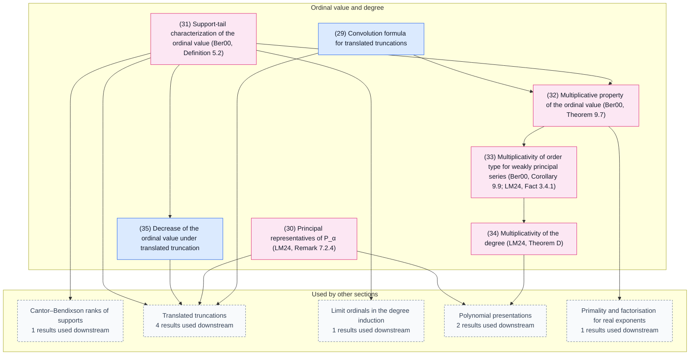
</details>

<a id="phase-cantor-bendixson-ranks"></a>
<details>
<summary>Cantor–Bendixson ranks of supports</summary>

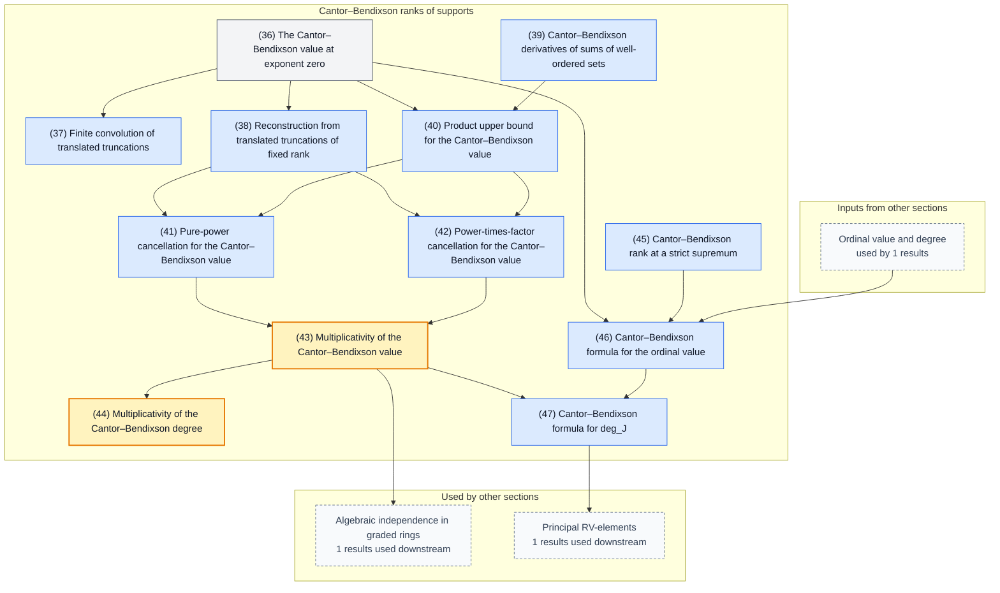
</details>

<a id="phase-associated-graded-algebraic-independence"></a>
<details>
<summary>Algebraic independence in graded rings</summary>

```mermaid
%% Generated by scripts/blueprint.sh; do not edit.
%% Other sections are compressed to boundary nodes.
%% Solid arrows are proof dependencies; dashed arrows are statement dependencies.
flowchart TB
  subgraph inputs["Inputs from other sections"]
    direction TB
    in0["Algebraic and ordinal preliminaries<br/>used by 10 results"]:::boundary
    in1["Cantor–Bendixson ranks of supports<br/>used by 7 results"]:::boundary
  end
  subgraph current["Algebraic independence in graded rings"]
    direction TB
    n048["(48) Discrete finite unions of Cantor–Bendixson rank sets"]:::lemma
    n049["(49) Cofactors from local data by well-founded induction"]:::lemma
    n050["(50) Local ideal membership in the associated graded ring"]:::lemma
    n051["(51) Polynomial syzygies from homogeneous ideal membership"]:::lemma
    n052["(52) Local-to-global principle for homogeneous ideal membership"]:::lemma
    n053["(53) The successor formula for the Cantor–Bendixson derivation"]:::lemma
    n054["(54) The Leibniz rule for the Cantor–Bendixson derivation"]:::lemma
    n055["(55) Prescribing the Cantor–Bendixson derivative on one exact-rank set"]:::lemma
    n056["(56) The derivative criterion for successor ideal membership"]:::lemma
    n057["(57) Prescribing the Cantor–Bendixson derivative on a discrete set"]:::lemma
    n058["(58) Leading-coefficient obstruction for homogeneous relations"]:::lemma
    n059["(59) Injectivity of evaluation when the degree is a limit ordinal"]:::lemma
    n060["(60) Simultaneous Cantor–Bendixson derivatives of homogeneous tuples"]:::lemma
    n061["(61) Successor step for Cantor–Bendixson homogeneous evaluation"]:::lemma
    n062["(62) Degreewise injectivity of homogeneous evaluation"]:::lemma
    n063["(63) Algebraic independence of a minimal homogeneous generating system"]:::theorem
    n064["(64) Local Jacobian ideal membership for translated partial derivatives"]:::lemma
    n065["(65) Maximal-variable linearity for the Cantor–Bendixson degree"]:::lemma
    n066["(66) Partial-derivative decomposition when the degree is a limit ordinal"]:::lemma
    n067["(67) Well-founded Archimedean-ball bases"]:::lemma
    n068["(68) Algebraic independence in the Cantor–Bendixson associated graded ring"]:::theorem
  end
  subgraph outputs["Used by other sections"]
    direction TB
    out0["Principal RV-elements<br/>2 results used downstream"]:::boundary
    out1["Polynomial presentations<br/>3 results used downstream"]:::boundary
  end

  n049 --> n050
  n050 --> n052
  n051 --> n052
  n053 --> n054
  n053 --> n055
  n054 --> n056
  n055 --> n056
  n053 --> n057
  n048 --> n060
  n054 --> n060
  n057 --> n060
  n056 --> n061
  n060 --> n061
  n058 --> n062
  n059 --> n062
  n061 --> n062
  n062 --> n063
  n064 --> n065
  n052 --> n066
  n064 --> n066
  n062 --> n068
  n065 --> n068
  n066 --> n068
  n067 --> n068
  in1 --> n048
  in0 --> n049
  in1 --> n049
  in0 --> n051
  in1 --> n051
  in0 --> n052
  in1 --> n053
  in0 --> n056
  in0 --> n058
  in1 --> n058
  in0 --> n059
  in1 --> n059
  in0 --> n061
  in0 --> n064
  in1 --> n064
  in0 --> n065
  in0 --> n066
  n063 --> out0
  n065 --> out0
  n068 --> out1
  n063 --> out1
  n065 --> out1
  click n048 "https://gaearon.github.io/conway-refinement/#/result/discrete-finite-union-cantor-bendixson-rank-sets" "Open the statement for lemma 48"
  click n049 "https://gaearon.github.io/conway-refinement/#/result/well-founded-cofactor-construction" "Open the statement for lemma 49"
  click n050 "https://gaearon.github.io/conway-refinement/#/result/local-ideal-membership-associated-graded" "Open the statement for lemma 50"
  click n051 "https://gaearon.github.io/conway-refinement/#/result/homogeneous-ideal-membership-polynomial-syzygy" "Open the statement for lemma 51"
  click n052 "https://gaearon.github.io/conway-refinement/#/result/eventual-local-ideal-membership-gives-syzygy" "Open the statement for lemma 52"
  click n053 "https://gaearon.github.io/conway-refinement/#/result/cantor-bendixson-derivation-successor-formula" "Open the statement for lemma 53"
  click n054 "https://gaearon.github.io/conway-refinement/#/result/cantor-bendixson-derivation-leibniz" "Open the statement for lemma 54"
  click n055 "https://gaearon.github.io/conway-refinement/#/result/prescribed-cantor-bendixson-derivative-exact-rank" "Open the statement for lemma 55"
  click n056 "https://gaearon.github.io/conway-refinement/#/result/successor-ideal-membership-from-cantor-bendixson-derivative" "Open the statement for lemma 56"
  click n057 "https://gaearon.github.io/conway-refinement/#/result/prescribed-cantor-bendixson-derivative-discrete-set" "Open the statement for lemma 57"
  click n058 "https://gaearon.github.io/conway-refinement/#/result/cantor-bendixson-leading-coefficient" "Open the statement for lemma 58"
  click n059 "https://gaearon.github.io/conway-refinement/#/result/cantor-bendixson-limit-ordinal-evaluation" "Open the statement for lemma 59"
  click n060 "https://gaearon.github.io/conway-refinement/#/result/simultaneous-cantor-bendixson-derivative-representatives" "Open the statement for lemma 60"
  click n061 "https://gaearon.github.io/conway-refinement/#/result/cantor-bendixson-successor-step" "Open the statement for lemma 61"
  click n062 "https://gaearon.github.io/conway-refinement/#/result/cantor-bendixson-degree-induction" "Open the statement for lemma 62"
  click n063 "https://gaearon.github.io/conway-refinement/#/result/cantor-bendixson-polynomiality" "Open the statement for theorem 63"
  click n064 "https://gaearon.github.io/conway-refinement/#/result/local-jacobian-ideal-membership" "Open the statement for lemma 64"
  click n065 "https://gaearon.github.io/conway-refinement/#/result/linear-occurrence" "Open the statement for lemma 65"
  click n066 "https://gaearon.github.io/conway-refinement/#/result/limit-ordinal-partial-derivative-decomposition" "Open the statement for lemma 66"
  click n067 "https://gaearon.github.io/conway-refinement/#/result/well-founded-archimedean-ball-basis" "Open the statement for lemma 67"
  click n068 "https://gaearon.github.io/conway-refinement/#/result/cantor-bendixson-minimal-generators-independent" "Open the statement for theorem 68"

  classDef theorem fill:#fff3bf,stroke:#e67700,stroke-width:2px,color:#111827
  classDef definition fill:#f3f4f6,stroke:#4b5563,color:#111827
  classDef lemma fill:#dbeafe,stroke:#2563eb,color:#111827
  classDef proposition fill:#ede9fe,stroke:#7c3aed,color:#111827
  classDef corollary fill:#dcfce7,stroke:#16a34a,color:#111827
  classDef fact fill:#fce7f3,stroke:#db2777,color:#111827
  classDef boundary fill:#f8fafc,stroke:#64748b,stroke-dasharray:4 3,color:#334155
```
</details>

<a id="phase-translated-truncations"></a>
<details>
<summary>Translated truncations</summary>

```mermaid
%% Generated by scripts/blueprint.sh; do not edit.
%% Other sections are compressed to boundary nodes.
%% Solid arrows are proof dependencies; dashed arrows are statement dependencies.
flowchart TB
  subgraph inputs["Inputs from other sections"]
    direction TB
    in0["Algebraic and ordinal preliminaries<br/>used by 3 results"]:::boundary
    in1["Ordinal value and degree<br/>used by 9 results"]:::boundary
  end
  subgraph current["Translated truncations"]
    direction TB
    n069["(69) Translated truncations of successor ordinal value"]:::lemma
    n070["(70) Injectivity of the translated-truncation map on P_α"]:::proposition
    n071["(71) Initial form of a weighted-homogeneous evaluation"]:::lemma
    n072["(72) Existence of polynomial representatives modulo J"]:::proposition
    n073["(73) Ordinal value of a polynomial evaluation"]:::proposition
    n074["(74) Omission of a maximal-weight variable from proper truncation representatives"]:::lemma
    n075["(75) Ordinal value of a polynomial representative"]:::proposition
    n076["(76) Leibniz rule for the lowering derivation"]:::theorem
    n077["(77) Local finiteness of translated truncations at successor ordinal value"]:::lemma
    n078["(78) Countable-support representatives of P_α"]:::lemma
    n079["(79) Detection of support order type by a translated truncation"]:::lemma
    n080["(80) Detection of interval support order type by a translated truncation"]:::lemma
    n081["(81) Support-order bound from uniformly small translated truncations"]:::corollary
    n082["(82) Ordinal-value bound for proper translated truncations of a principal series"]:::lemma
    n083["(83) Homogeneous component representing a class in P_β"]:::lemma
    n084["(84) Translated truncations of monomials in principal series"]:::lemma
    n085["(85) Translated truncations of weighted-homogeneous polynomials"]:::lemma
    n086["(86) High-degree components of translated truncations of a polynomial multiple"]:::lemma
    n087["(87) Prescribed P_δ classes at translated truncations"]:::proposition
    n088["(88) Derivative criterion for homogeneous ideal membership"]:::proposition
    n089["(89) Convolution formula for polynomial representatives"]:::lemma
    n090["(90) Leading coefficient after translated truncation"]:::lemma
    n091["(91) Polynomial Leibniz rule for translated truncations"]:::lemma
    n092["(92) Differentiated polynomial Leibniz rule"]:::lemma
    n093["(93) High-degree Jacobian ideal membership"]:::lemma
    n094["(94) Ideal membership in P_{τ + 1} from translated truncations"]:::lemma
  end
  subgraph outputs["Used by other sections"]
    direction TB
    out0["Limit ordinals in the degree induction<br/>6 results used downstream"]:::boundary
    out1["Principal RV-elements<br/>1 results used downstream"]:::boundary
    out2["Polynomial presentations<br/>1 results used downstream"]:::boundary
  end

  n069 --> n070
  n071 --> n072
  n071 --> n073
  n072 --> n074
  n073 --> n074
  n072 --> n075
  n073 --> n075
  n070 --> n078
  n077 --> n078
  n079 --> n080
  n079 --> n081
  n072 --> n083
  n073 --> n083
  n071 --> n084
  n082 --> n084
  n084 --> n085
  n072 --> n086
  n073 --> n086
  n085 --> n086
  n076 --> n088
  n078 --> n088
  n087 --> n088
  n072 --> n089
  n073 --> n089
  n074 --> n090
  n089 --> n090
  n089 --> n091
  n091 --> n092
  n082 --> n093
  n092 --> n093
  n083 --> n094
  n088 --> n094
  in1 --> n069
  in1 --> n070
  in0 --> n072
  in1 --> n072
  in1 --> n074
  in1 --> n076
  in1 --> n078
  in1 --> n084
  in0 --> n087
  in1 --> n087
  in1 --> n089
  in0 --> n093
  n081 --> out0
  n085 --> out0
  n094 --> out0
  n075 --> out0
  n093 --> out0
  n086 --> out0
  n082 --> out1
  n072 --> out2
  click n069 "https://gaearon.github.io/conway-refinement/#/result/successor-truncation-value" "Open the statement for lemma 69"
  click n070 "https://gaearon.github.io/conway-refinement/#/result/successor-principal-rv-injective" "Open the statement for proposition 70"
  click n071 "https://gaearon.github.io/conway-refinement/#/result/homogeneous-evaluation-represents" "Open the statement for lemma 71"
  click n072 "https://gaearon.github.io/conway-refinement/#/result/polynomial-representative-exists" "Open the statement for proposition 72"
  click n073 "https://gaearon.github.io/conway-refinement/#/result/polynomial-evaluation-ordinal-value" "Open the statement for proposition 73"
  click n074 "https://gaearon.github.io/conway-refinement/#/result/proper-truncation-omits-variable" "Open the statement for lemma 74"
  click n075 "https://gaearon.github.io/conway-refinement/#/result/ordinal-value-of-polynomial-representative" "Open the statement for proposition 75"
  click n076 "https://gaearon.github.io/conway-refinement/#/result/leibniz-rule-lowering-derivation" "Open the statement for theorem 76"
  click n077 "https://gaearon.github.io/conway-refinement/#/result/finite-successor-value-cutoffs" "Open the statement for lemma 77"
  click n078 "https://gaearon.github.io/conway-refinement/#/result/successor-principal-rv-countable-support" "Open the statement for lemma 78"
  click n079 "https://gaearon.github.io/conway-refinement/#/result/cutoff-detects-support-order" "Open the statement for lemma 79"
  click n080 "https://gaearon.github.io/conway-refinement/#/result/cutoff-detects-support-order-in-interval" "Open the statement for lemma 80"
  click n081 "https://gaearon.github.io/conway-refinement/#/result/small-truncations-small-support" "Open the statement for corollary 81"
  click n082 "https://gaearon.github.io/conway-refinement/#/result/principal-truncations-lower-value" "Open the statement for lemma 82"
  click n083 "https://gaearon.github.io/conway-refinement/#/result/polynomial-homogeneous-component-represents-class" "Open the statement for lemma 83"
  click n084 "https://gaearon.github.io/conway-refinement/#/result/principal-representatives-truncation" "Open the statement for lemma 84"
  click n085 "https://gaearon.github.io/conway-refinement/#/result/principal-representatives-homogeneous-polynomial-truncation" "Open the statement for lemma 85"
  click n086 "https://gaearon.github.io/conway-refinement/#/result/term-truncation-condition" "Open the statement for lemma 86"
  click n087 "https://gaearon.github.io/conway-refinement/#/result/realise-derivative" "Open the statement for proposition 87"
  click n088 "https://gaearon.github.io/conway-refinement/#/result/ideal-from-derivative" "Open the statement for proposition 88"
  click n089 "https://gaearon.github.io/conway-refinement/#/result/polynomial-convolution-formula" "Open the statement for lemma 89"
  click n090 "https://gaearon.github.io/conway-refinement/#/result/leading-coefficient-of-truncated-product" "Open the statement for lemma 90"
  click n091 "https://gaearon.github.io/conway-refinement/#/result/leibniz-remainder" "Open the statement for lemma 91"
  click n092 "https://gaearon.github.io/conway-refinement/#/result/differentiated-leibniz-remainder" "Open the statement for lemma 92"
  click n093 "https://gaearon.github.io/conway-refinement/#/result/differentiated-relation" "Open the statement for lemma 93"
  click n094 "https://gaearon.github.io/conway-refinement/#/result/lower-below-successor" "Open the statement for lemma 94"

  classDef theorem fill:#fff3bf,stroke:#e67700,stroke-width:2px,color:#111827
  classDef definition fill:#f3f4f6,stroke:#4b5563,color:#111827
  classDef lemma fill:#dbeafe,stroke:#2563eb,color:#111827
  classDef proposition fill:#ede9fe,stroke:#7c3aed,color:#111827
  classDef corollary fill:#dcfce7,stroke:#16a34a,color:#111827
  classDef fact fill:#fce7f3,stroke:#db2777,color:#111827
  classDef boundary fill:#f8fafc,stroke:#64748b,stroke-dasharray:4 3,color:#334155
```
</details>

<a id="phase-limit-degree"></a>
<details>
<summary>Limit ordinals in the degree induction</summary>

```mermaid
%% Generated by scripts/blueprint.sh; do not edit.
%% Other sections are compressed to boundary nodes.
%% Solid arrows are proof dependencies; dashed arrows are statement dependencies.
flowchart TB
  subgraph inputs["Inputs from other sections"]
    direction TB
    in0["Algebraic and ordinal preliminaries<br/>used by 8 results"]:::boundary
    in1["Ordinal value and degree<br/>used by 1 results"]:::boundary
    in2["Translated truncations<br/>used by 4 results"]:::boundary
  end
  subgraph current["Limit ordinals in the degree induction"]
    direction TB
    n095["(95) Linearity when (w_B)_{&lt; β} ⊕ ν ≠ λ_0 for every ν"]:::lemma
    n096["(96) Separation of last Cantor terms under a two-factor bound"]:::lemma
    n097["(97) Upper Cantor terms at the complementary low weight"]:::lemma
    n098["(98) Translated truncations of interval pieces"]:::lemma
    n099["(99) Translated truncations of shifted truncation sums"]:::lemma
    n100["(100) Order type of a sum along cutoffs"]:::lemma
    n101["(101) Finiteness of translated truncations above an ordinal-value bound"]:::lemma
    n102["(102) Support-order reduction at a successor degree"]:::lemma
    n103["(103) Realisation of lower ordinal values by translated truncations"]:::lemma
    n104["(104) Maximal-variable linearity for the ordinal-value degree"]:::lemma
    n105["(105) Support-order reduction by interval decomposition"]:::lemma
    n106["(106) Translated-truncation approximation at intermediate degrees"]:::lemma
    n107["(107) Ideal membership from translated truncations"]:::proposition
    n108["(108) Partial-derivative syzygy when (w_{B'})_{&lt; β} ⊕ η = λ_0 for some η"]:::proposition
  end
  subgraph outputs["Used by other sections"]
    direction TB
    out0["Principal RV-elements<br/>1 results used downstream"]:::boundary
  end

  n095 --> n097
  n096 --> n097
  n101 --> n102
  n103 --> n104
  n098 --> n105
  n099 --> n105
  n100 --> n105
  n101 --> n105
  n103 --> n105
  n102 --> n106
  n105 --> n106
  n106 --> n107
  n097 --> n108
  n107 --> n108
  in0 --> n095
  in0 --> n096
  in0 --> n099
  in0 --> n100
  in0 --> n102
  in2 --> n102
  in1 --> n103
  in0 --> n104
  in2 --> n104
  in2 --> n105
  in0 --> n106
  in0 --> n108
  in2 --> n108
  n108 --> out0
  click n095 "https://gaearon.github.io/conway-refinement/#/result/low-degree-part-outside-algebraic-bound-occurs-linearly" "Open the statement for lemma 95"
  click n096 "https://gaearon.github.io/conway-refinement/#/result/later-cantor-terms-outside-algebraic-bound" "Open the statement for lemma 96"
  click n097 "https://gaearon.github.io/conway-refinement/#/result/complementary-cantor-tail" "Open the statement for lemma 97"
  click n098 "https://gaearon.github.io/conway-refinement/#/result/window-truncation" "Open the statement for lemma 98"
  click n099 "https://gaearon.github.io/conway-refinement/#/result/cutoff-sum-truncation" "Open the statement for lemma 99"
  click n100 "https://gaearon.github.io/conway-refinement/#/result/cutoff-sum-support" "Open the statement for lemma 100"
  click n101 "https://gaearon.github.io/conway-refinement/#/result/successor-large-truncations-finite" "Open the statement for lemma 101"
  click n102 "https://gaearon.github.io/conway-refinement/#/result/successor-support-lowering" "Open the statement for lemma 102"
  click n103 "https://gaearon.github.io/conway-refinement/#/result/truncation-values" "Open the statement for lemma 103"
  click n104 "https://gaearon.github.io/conway-refinement/#/result/relation-at-limit-ordinal-maximal-variable-linear" "Open the statement for lemma 104"
  click n105 "https://gaearon.github.io/conway-refinement/#/result/lower-by-pieces" "Open the statement for lemma 105"
  click n106 "https://gaearon.github.io/conway-refinement/#/result/induction-over-degrees" "Open the statement for lemma 106"
  click n107 "https://gaearon.github.io/conway-refinement/#/result/ideal-from-truncations" "Open the statement for proposition 107"
  click n108 "https://gaearon.github.io/conway-refinement/#/result/partials-when-low-degree-part-is-algebraically-bounded" "Open the statement for proposition 108"

  classDef theorem fill:#fff3bf,stroke:#e67700,stroke-width:2px,color:#111827
  classDef definition fill:#f3f4f6,stroke:#4b5563,color:#111827
  classDef lemma fill:#dbeafe,stroke:#2563eb,color:#111827
  classDef proposition fill:#ede9fe,stroke:#7c3aed,color:#111827
  classDef corollary fill:#dcfce7,stroke:#16a34a,color:#111827
  classDef fact fill:#fce7f3,stroke:#db2777,color:#111827
  classDef boundary fill:#f8fafc,stroke:#64748b,stroke-dasharray:4 3,color:#334155
```
</details>

<a id="phase-principal-rv-algebraic-independence"></a>
<details>
<summary>Principal RV-elements</summary>

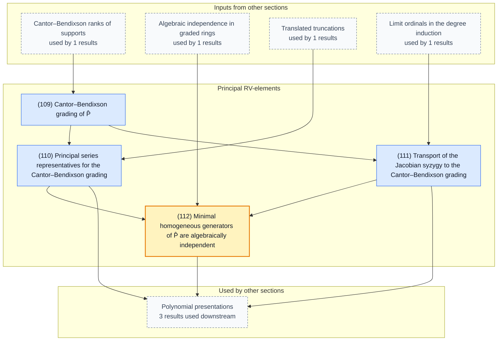
</details>

<a id="phase-polynomial-presentations"></a>
<details>
<summary>Polynomial presentations</summary>

```mermaid
%% Generated by scripts/blueprint.sh; do not edit.
%% Other sections are compressed to boundary nodes.
%% Solid arrows are proof dependencies; dashed arrows are statement dependencies.
flowchart TB
  subgraph inputs["Inputs from other sections"]
    direction TB
    in0["Algebraic and ordinal preliminaries<br/>used by 4 results"]:::boundary
    in1["Ordinal value and degree<br/>used by 1 results"]:::boundary
    in2["Algebraic independence in graded rings<br/>used by 2 results"]:::boundary
    in3["Translated truncations<br/>used by 2 results"]:::boundary
    in4["Principal RV-elements<br/>used by 6 results"]:::boundary
  end
  subgraph current["Polynomial presentations"]
    direction TB
    n113["(113) Scalar extension from P̂ to RV̂ (LM24, Proposition 6.1.2)"]:::fact
    n114["(114) Polynomial presentation of the germ ring over a Cauchy-complete exponent group"]:::theorem
    n115["(115) Weighted degree under evaluation at series lifts"]:::theorem
    n116["(116) Algebraic independence of series lifts"]:::theorem
    n117["(117) Generation of the series ring by series lifts"]:::theorem
    n118["(118) Polynomial presentation of the series ring"]:::theorem
    n119["(119) Polynomial presentation of P̂"]:::corollary
    n120["(120) Algebraic independence of homogeneous families in P̂"]:::corollary
    n121["(121) Algebraic independence in additively principal degree"]:::corollary
    n122["(122) Prime elements of additively principal degree"]:::corollary
    n123["(123) Surjectivity of evaluation modulo J"]:::lemma
    n124["(124) Injectivity of evaluation modulo J"]:::lemma
    n125["(125) Polynomial presentation of the quotient by J"]:::theorem
    n126["(126) Polynomial representative of a germ"]:::theorem
    n127["(127) Polynomial representatives below an ordinal-value bound"]:::theorem
  end
  subgraph outputs["Used by other sections"]
    direction TB
    out0["Primality and factorisation for real exponents<br/>1 results used downstream"]:::boundary
    out1["Refinement and transfinite induction<br/>1 results used downstream"]:::boundary
  end

  n113 --> n115
  n113 --> n116
  n113 --> n117
  n116 --> n118
  n117 --> n118
  n120 --> n121
  n119 --> n122
  n123 --> n125
  n124 --> n125
  n125 --> n126
  in1 --> n113
  in0 --> n114
  in2 --> n114
  in4 --> n115
  in4 --> n116
  in0 --> n117
  in4 --> n117
  in4 --> n119
  in0 --> n120
  in4 --> n120
  in0 --> n122
  in3 --> n123
  in2 --> n124
  in4 --> n124
  in3 --> n127
  n118 --> out0
  n114 --> out1
  click n113 "https://gaearon.github.io/conway-refinement/#/result/principal-subring-tensor-decomposition" "Open the statement for fact 113"
  click n114 "https://gaearon.github.io/conway-refinement/#/result/complete-hahn-germ-polynomial-algebra" "Open the statement for theorem 114"
  click n115 "https://gaearon.github.io/conway-refinement/#/result/series-polynomial-degree" "Open the statement for theorem 115"
  click n116 "https://gaearon.github.io/conway-refinement/#/result/series-lifts-algebraically-independent" "Open the statement for theorem 116"
  click n117 "https://gaearon.github.io/conway-refinement/#/result/series-lifts-generate-series-ring" "Open the statement for theorem 117"
  click n118 "https://gaearon.github.io/conway-refinement/#/result/hahn-series-polynomial-algebra" "Open the statement for theorem 118"
  click n119 "https://gaearon.github.io/conway-refinement/#/result/principal-subring-polynomial-algebra" "Open the statement for corollary 119"
  click n120 "https://gaearon.github.io/conway-refinement/#/result/independent-homogeneous-family" "Open the statement for corollary 120"
  click n121 "https://gaearon.github.io/conway-refinement/#/result/principal-degree-linear-independence" "Open the statement for corollary 121"
  click n122 "https://gaearon.github.io/conway-refinement/#/result/prime-at-principal-degree" "Open the statement for corollary 122"
  click n123 "https://gaearon.github.io/conway-refinement/#/result/ordinal-value-quotient-evaluation-surjective" "Open the statement for lemma 123"
  click n124 "https://gaearon.github.io/conway-refinement/#/result/ordinal-value-quotient-evaluation-injective" "Open the statement for lemma 124"
  click n125 "https://gaearon.github.io/conway-refinement/#/result/ordinal-value-quotient" "Open the statement for theorem 125"
  click n126 "https://gaearon.github.io/conway-refinement/#/result/ordinal-value-quotient-polynomial-representative" "Open the statement for theorem 126"
  click n127 "https://gaearon.github.io/conway-refinement/#/result/ordinal-value-quotient-filtration" "Open the statement for theorem 127"

  classDef theorem fill:#fff3bf,stroke:#e67700,stroke-width:2px,color:#111827
  classDef definition fill:#f3f4f6,stroke:#4b5563,color:#111827
  classDef lemma fill:#dbeafe,stroke:#2563eb,color:#111827
  classDef proposition fill:#ede9fe,stroke:#7c3aed,color:#111827
  classDef corollary fill:#dcfce7,stroke:#16a34a,color:#111827
  classDef fact fill:#fce7f3,stroke:#db2777,color:#111827
  classDef boundary fill:#f8fafc,stroke:#64748b,stroke-dasharray:4 3,color:#334155
```
</details>

<a id="phase-real-exponent-primality"></a>
<details>
<summary>Primality and factorisation for real exponents</summary>

```mermaid
%% Generated by scripts/blueprint.sh; do not edit.
%% Other sections are compressed to boundary nodes.
%% Solid arrows are proof dependencies; dashed arrows are statement dependencies.
flowchart TB
  subgraph inputs["Inputs from other sections"]
    direction TB
    in0["Algebraic and ordinal preliminaries<br/>used by 1 results"]:::boundary
    in1["Ordinal value and degree<br/>used by 1 results"]:::boundary
    in2["Polynomial presentations<br/>used by 1 results"]:::boundary
  end
  subgraph current["Primality and factorisation for real exponents"]
    direction TB
    n128["(128) Irreducibility from translated truncation dimension"]:::fact
    n129["(129) Greatest common divisors of finite-support series"]:::fact
    n130["(130) Greatest common divisors in K((ℝ^{≤ 0}))"]:::theorem
    n131["(131) Primality of generalised power series"]:::theorem
    n132["(132) Primality criterion for series of degree one"]:::corollary
    n133["(133) Irreducible series are prime"]:::corollary
    n134["(134) Random series of finite Cantor degree are prime"]:::corollary
    n135["(135) Lower-order perturbations of random series are prime"]:::corollary
    n136["(136) Random principal series of positive finite degree are prime"]:::corollary
    n137["(137) Unique factorisation under support-order conditions"]:::corollary
  end
  subgraph outputs["Used by other sections"]
    direction TB
    out0["Reduction along Archimedean classes<br/>1 results used downstream"]:::boundary
    out1["Surreal numbers and omnific integers<br/>2 results used downstream"]:::boundary
  end

  n129 --> n130
  n130 --> n131
  n131 --> n132
  n131 --> n133
  n133 --> n134
  n133 --> n135
  n133 --> n136
  n133 --> n137
  in1 --> n128
  in0 --> n130
  in2 --> n130
  n131 --> out0
  n128 --> out1
  n133 --> out1
  click n128 "https://gaearon.github.io/conway-refinement/#/result/ps06-irreducibility" "Open the statement for fact 128"
  click n129 "https://gaearon.github.io/conway-refinement/#/result/finite-support-hahn-gcd" "Open the statement for fact 129"
  click n130 "https://gaearon.github.io/conway-refinement/#/result/hahn-series-gcd-domain" "Open the statement for theorem 130"
  click n131 "https://gaearon.github.io/conway-refinement/#/result/hahn-series-primality" "Open the statement for theorem 131"
  click n132 "https://gaearon.github.io/conway-refinement/#/result/degree-one" "Open the statement for corollary 132"
  click n133 "https://gaearon.github.io/conway-refinement/#/result/hahn-series-irreducible-is-prime" "Open the statement for corollary 133"
  click n134 "https://gaearon.github.io/conway-refinement/#/result/random-series-prime" "Open the statement for corollary 134"
  click n135 "https://gaearon.github.io/conway-refinement/#/result/random-series-small-perturbation" "Open the statement for corollary 135"
  click n136 "https://gaearon.github.io/conway-refinement/#/result/random-principal-series-prime" "Open the statement for corollary 136"
  click n137 "https://gaearon.github.io/conway-refinement/#/result/lm17-support-order" "Open the statement for corollary 137"

  classDef theorem fill:#fff3bf,stroke:#e67700,stroke-width:2px,color:#111827
  classDef definition fill:#f3f4f6,stroke:#4b5563,color:#111827
  classDef lemma fill:#dbeafe,stroke:#2563eb,color:#111827
  classDef proposition fill:#ede9fe,stroke:#7c3aed,color:#111827
  classDef corollary fill:#dcfce7,stroke:#16a34a,color:#111827
  classDef fact fill:#fce7f3,stroke:#db2777,color:#111827
  classDef boundary fill:#f8fafc,stroke:#64748b,stroke-dasharray:4 3,color:#334155
```
</details>

<a id="phase-finite-archimedean-support"></a>
<details>
<summary>Reduction along Archimedean classes</summary>

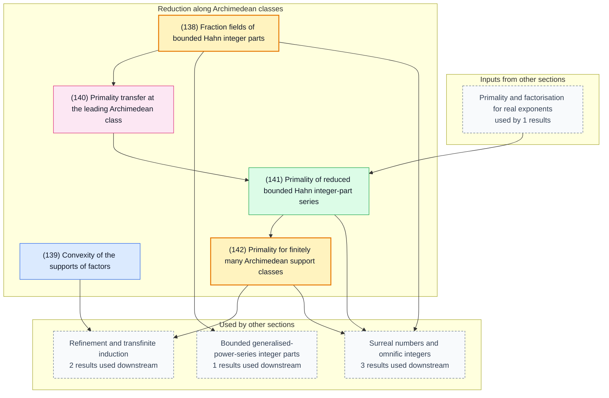
</details>

<a id="phase-archimedean-class-refinement"></a>
<details>
<summary>Refinement and transfinite induction</summary>

```mermaid
%% Generated by scripts/blueprint.sh; do not edit.
%% Other sections are compressed to boundary nodes.
%% Solid arrows are proof dependencies; dashed arrows are statement dependencies.
flowchart TB
  subgraph inputs["Inputs from other sections"]
    direction TB
    in0["Algebraic and ordinal preliminaries<br/>used by 1 results"]:::boundary
    in1["Polynomial presentations<br/>used by 2 results"]:::boundary
    in2["Reduction along Archimedean classes<br/>used by 3 results"]:::boundary
  end
  subgraph current["Refinement and transfinite induction"]
    direction TB
    n143["(143) Normalization of a closed-class refinement in a Hahn integer part"]:::lemma
    n144["(144) Closed-ball restriction under quotient regrouping"]:::lemma
    n145["(145) Four-factor refinement in the germ ring over a Cauchy-complete exponent group"]:::theorem
    n146["(146) Divisibility from a convex restriction"]:::lemma
    n147["(147) Transport of refinement from a quotient Archimedean class"]:::lemma
    n148["(148) Factorisation by a convex restriction"]:::lemma
    n149["(149) Support classes beyond a quotient Archimedean ball"]:::lemma
    n150["(150) An irreducible germ with zero constant coefficient"]:::lemma
    n151["(151) Refinement forces K = Frac(Z)"]:::theorem
    n152["(152) Strict decrease of support-class order type"]:::lemma
    n153["(153) Factorisation at a quotient Archimedean class"]:::lemma
    n154["(154) Well-ordered subsets of closed rational spans"]:::lemma
    n155["(155) Cardinal-bounded refinement modulo series bounded away from zero"]:::theorem
    n156["(156) Exact refinement over a Cauchy-complete common-tail quotient"]:::theorem
    n157["(157) Refinement at a quotient Archimedean class"]:::theorem
    n158["(158) Transfinite extension of finite-class primality"]:::theorem
    n159["(159) Primality under finite-class and common-tail hypotheses"]:::theorem
  end
  subgraph outputs["Used by other sections"]
    direction TB
    out0["Bounded generalised-power-series integer parts<br/>1 results used downstream"]:::boundary
    out1["Surreal numbers and omnific integers<br/>1 results used downstream"]:::boundary
  end

  n144 --> n147
  n146 --> n147
  n150 --> n151
  n148 --> n153
  n149 --> n153
  n152 --> n153
  n145 --> n155
  n154 --> n155
  n155 --> n156
  n143 --> n157
  n156 --> n157
  n147 --> n158
  n153 --> n158
  n157 --> n158
  n158 --> n159
  in1 --> n145
  in2 --> n147
  in1 --> n150
  in0 --> n151
  in2 --> n157
  in2 --> n159
  n159 --> out0
  n158 --> out1
  click n143 "https://gaearon.github.io/conway-refinement/#/result/closed-class-refinement-normalization" "Open the statement for lemma 143"
  click n144 "https://gaearon.github.io/conway-refinement/#/result/quotient-regrouping-closed-ball-restriction" "Open the statement for lemma 144"
  click n145 "https://gaearon.github.io/conway-refinement/#/result/complete-hahn-germ-refinement" "Open the statement for theorem 145"
  click n146 "https://gaearon.github.io/conway-refinement/#/result/divisibility-from-convex-restriction" "Open the statement for lemma 146"
  click n147 "https://gaearon.github.io/conway-refinement/#/result/closed-class-refinement-transport" "Open the statement for lemma 147"
  click n148 "https://gaearon.github.io/conway-refinement/#/result/factorisation-by-convex-restriction" "Open the statement for lemma 148"
  click n149 "https://gaearon.github.io/conway-refinement/#/result/tail-quotient-class-bounds-support-classes" "Open the statement for lemma 149"
  click n150 "https://gaearon.github.io/conway-refinement/#/result/irreducible-zero-constant-germ" "Open the statement for lemma 150"
  click n151 "https://gaearon.github.io/conway-refinement/#/result/refinement-forces-coefficient-fraction-field" "Open the statement for theorem 151"
  click n152 "https://gaearon.github.io/conway-refinement/#/result/support-class-order-type-strict-decrease" "Open the statement for lemma 152"
  click n153 "https://gaearon.github.io/conway-refinement/#/result/support-class-factorisation" "Open the statement for lemma 153"
  click n154 "https://gaearon.github.io/conway-refinement/#/result/well-ordered-subset-closed-rational-span-cardinality" "Open the statement for lemma 154"
  click n155 "https://gaearon.github.io/conway-refinement/#/result/cardinal-bounded-germ-refinement" "Open the statement for theorem 155"
  click n156 "https://gaearon.github.io/conway-refinement/#/result/complete-tail-quotient-refinement" "Open the statement for theorem 156"
  click n157 "https://gaearon.github.io/conway-refinement/#/result/support-class-refinement" "Open the statement for theorem 157"
  click n158 "https://gaearon.github.io/conway-refinement/#/result/limit-tail-primality" "Open the statement for theorem 158"
  click n159 "https://gaearon.github.io/conway-refinement/#/result/hahn-integer-part-primality" "Open the statement for theorem 159"

  classDef theorem fill:#fff3bf,stroke:#e67700,stroke-width:2px,color:#111827
  classDef definition fill:#f3f4f6,stroke:#4b5563,color:#111827
  classDef lemma fill:#dbeafe,stroke:#2563eb,color:#111827
  classDef proposition fill:#ede9fe,stroke:#7c3aed,color:#111827
  classDef corollary fill:#dcfce7,stroke:#16a34a,color:#111827
  classDef fact fill:#fce7f3,stroke:#db2777,color:#111827
  classDef boundary fill:#f8fafc,stroke:#64748b,stroke-dasharray:4 3,color:#334155
```
</details>

<a id="phase-cauchy-completeness"></a>
<details>
<summary>A cut criterion for Cauchy completeness</summary>

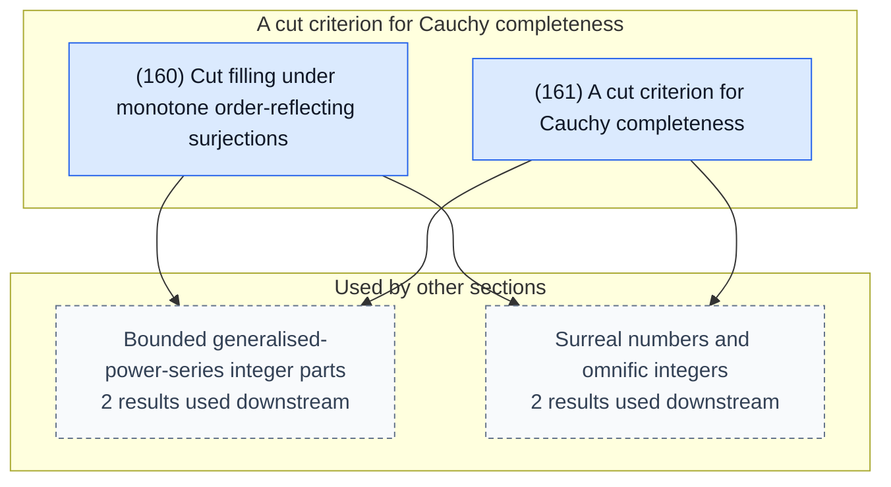
</details>

<a id="phase-bounded-integer-parts"></a>
<details>
<summary>Bounded generalised-power-series integer parts</summary>

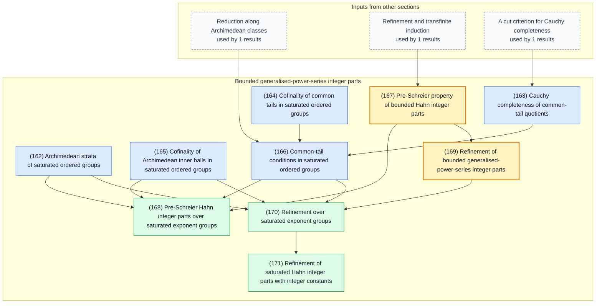
</details>

<a id="phase-conway-refinement"></a>
<details>
<summary>Surreal numbers and omnific integers</summary>

```mermaid
%% Generated by scripts/blueprint.sh; do not edit.
%% Other sections are compressed to boundary nodes.
%% Solid arrows are proof dependencies; dashed arrows are statement dependencies.
flowchart TB
  subgraph inputs["Inputs from other sections"]
    direction TB
    in0["Primality and factorisation for real exponents<br/>used by 2 results"]:::boundary
    in1["Reduction along Archimedean classes<br/>used by 4 results"]:::boundary
    in2["Refinement and transfinite induction<br/>used by 1 results"]:::boundary
    in3["A cut criterion for Cauchy completeness<br/>used by 1 results"]:::boundary
  end
  subgraph current["Surreal numbers and omnific integers"]
    direction TB
    n172["(172) Primality of an explicit degree-two series"]:::theorem
    n173["(173) Equivalence of the cut and subring formulations of Conway's refinement conjecture"]:::theorem
    n174["(174) Real structure of surreal Archimedean strata"]:::fact
    n175["(175) Cofinality of surreal Archimedean balls"]:::fact
    n176["(176) Cofinality of common surreal Archimedean tails"]:::lemma
    n177["(177) Fraction fields of surreal common-tail integer parts"]:::theorem
    n178["(178) The simplicity theorem for small cuts"]:::theorem
    n179["(179) The signed normal-form isomorphism for omnific integers"]:::theorem
    n180["(180) Primality for finitely many Archimedean classes"]:::corollary
    n181["(181) Primality of reduced omnific integers outside ℤ"]:::theorem
    n182["(182) Irreducible omnific integers are prime"]:::theorem
    n183["(183) Primality of an explicit degree-two omnific integer"]:::theorem
    n184["(184) A coinitial family of positive elements in surreal common-tail quotients"]:::lemma
    n185["(185) Cauchy completeness of surreal common-tail quotients"]:::lemma
    n186["(186) Primality of the surreal Hahn integer part"]:::theorem
    n187["(187) Refinement property of Oz_u"]:::theorem
    n188["(188) Conway's refinement theorem for omnific integers"]:::theorem
  end

  n176 --> n177
  n174 --> n180
  n175 --> n180
  n179 --> n180
  n174 --> n181
  n175 --> n181
  n179 --> n181
  n181 --> n182
  n182 --> n183
  n178 --> n185
  n184 --> n185
  n174 --> n186
  n175 --> n186
  n177 --> n186
  n185 --> n186
  n179 --> n187
  n186 --> n187
  n173 --> n188
  n187 --> n188
  in0 --> n172
  in1 --> n177
  in1 --> n180
  in1 --> n181
  in0 --> n183
  in3 --> n185
  in1 --> n186
  in2 --> n186
  click n172 "https://gaearon.github.io/conway-refinement/#/result/degree-two-series-prime" "Open the statement for theorem 172"
  click n173 "https://gaearon.github.io/conway-refinement/#/result/conway-cut-subring-equivalence" "Open the statement for theorem 173"
  click n174 "https://gaearon.github.io/conway-refinement/#/result/surreal-archimedean-strata" "Open the statement for fact 174"
  click n175 "https://gaearon.github.io/conway-refinement/#/result/surreal-archimedean-ball-cofinality" "Open the statement for fact 175"
  click n176 "https://gaearon.github.io/conway-refinement/#/result/surreal-common-tail-cofinality" "Open the statement for lemma 176"
  click n177 "https://gaearon.github.io/conway-refinement/#/result/surreal-common-tail-integer-part-fraction-field" "Open the statement for theorem 177"
  click n178 "https://gaearon.github.io/conway-refinement/#/result/surreal-simplicity-small-cuts" "Open the statement for theorem 178"
  click n179 "https://gaearon.github.io/conway-refinement/#/result/signed-normal-form-omnific-integer-equivalence" "Open the statement for theorem 179"
  click n180 "https://gaearon.github.io/conway-refinement/#/result/omnific-finite-classes" "Open the statement for corollary 180"
  click n181 "https://gaearon.github.io/conway-refinement/#/result/reduced-omnific-primal" "Open the statement for theorem 181"
  click n182 "https://gaearon.github.io/conway-refinement/#/result/omnific-factorisation" "Open the statement for theorem 182"
  click n183 "https://gaearon.github.io/conway-refinement/#/result/explicit-omnific-prime" "Open the statement for theorem 183"
  click n184 "https://gaearon.github.io/conway-refinement/#/result/surreal-common-tail-quotient-coinitial-scales" "Open the statement for lemma 184"
  click n185 "https://gaearon.github.io/conway-refinement/#/result/surreal-common-tail-quotient-complete" "Open the statement for lemma 185"
  click n186 "https://gaearon.github.io/conway-refinement/#/result/surreal-hahn-integer-part-primality" "Open the statement for theorem 186"
  click n187 "https://gaearon.github.io/conway-refinement/#/result/omnific-integer-refinement-property" "Open the statement for theorem 187"
  click n188 "https://gaearon.github.io/conway-refinement/#/result/conway-refinement" "Open the statement for theorem 188"

  classDef theorem fill:#fff3bf,stroke:#e67700,stroke-width:2px,color:#111827
  classDef definition fill:#f3f4f6,stroke:#4b5563,color:#111827
  classDef lemma fill:#dbeafe,stroke:#2563eb,color:#111827
  classDef proposition fill:#ede9fe,stroke:#7c3aed,color:#111827
  classDef corollary fill:#dcfce7,stroke:#16a34a,color:#111827
  classDef fact fill:#fce7f3,stroke:#db2777,color:#111827
  classDef boundary fill:#f8fafc,stroke:#64748b,stroke-dasharray:4 3,color:#334155
```
</details>
<!-- blueprint-mermaid:end -->

These diagrams can also help AI refactor or simplify the overall proof path.

## But what was the conjecture about?

This conjecture is about *omnific integers*.

Omnific integers were invented (or discovered?) by John Conway. Intuitively, I'd describe them as an extension of integers as we know them ($-3$, $10$, $1840$, $-437349$) to infinity and beyond. Recall that there is no biggest integer: after $1$ comes $2$, after $2$ comes $3$, and so on. So if you say some $X$ is the biggest integer, I would point to $X + 1$, which is bigger, and you would be wrong. However, omnific integers *do* contain a number bigger than every regular integer. It's called $\omega$, "omega", and in a sense it represents an infinity: $\omega$ is "what stands after" every regular integer.

You might think that it ends there, but it doesn't.

You can add $1$ to get $\omega + 1$, then add $1$ again to get $\omega + 2$, and so on. Curiously, you can also go *backwards* — to $\omega - 1$, $\omega - 2$, $\omega - 800$, and so on. No matter how many finite steps you go down, you will never reach the "regular" integers. If you started off from $\omega$, you're just *too high already* to ever reach the regular integers. And it doesn't end here either. You can divide $\omega$, for example $\omega / 2$, and it would *still* be bigger than all regular integers. (Curiously, $\omega$ is even — it is divisible by 2 — but it is also divisible by 3, 4, or really by any integer except zero.)

You could also keep going up — perhaps, after another infinity of steps, reaching $\omega + \omega = \omega \cdot 2$, or further up to $\omega \cdot 3$, or, after making infinite jumps, to $\omega \cdot \omega = \omega^2$. You could keep going (or rather, "jumping" — walking can't even get you to $\omega$), stacking powers of omega into ever taller towers:

$$
\omega,\qquad \omega^\omega,\qquad \omega^{\omega^\omega},\qquad \ldots
$$

Now "jump" through doing *that* forever, and you'll reach a tower so tall that raising $\omega$ to it doesn't change it:

$$\omega^{\left(\omega^{\omega^{\omega^{\cdots}}}\right)} = \omega^{\omega^{\omega^{\cdots}}}.$$

And yet you could still keep on going.

All of this is very strange, but what is stranger is that it all "falls out" of a very simple theory.

Forget all the numbers you know. Define a single number called "zero" and then go step by step. At every step, invent a new number at each distinct gap between the numbers you already have ("to the left of all" and "to the right of all" also count as gaps). Continue doing this forever, and then forevermore forever, and so on.

Turns out, if you do this forever, you'll get a fractal tree of [all numbers great and small](https://upload.wikimedia.org/wikipedia/commons/4/49/Surreal_number_tree.svg):


*(Illustration by Joel David Hamkins, go [read his posts](https://www.infinitelymore.xyz/p/surreal-numbers) and [buy his book!](https://jdh.hamkins.org/the-book-of-infinity/))*

This simple recursive binary tree turns out to produce exactly the numbers we commonly use in life — naturals, integers, rationals, reals — as well as weirder numbers such as infinite "ordinals" like $\omega$, "infinitesimals" like $\frac{1}{\omega}$, and all sorts of combinations between them, such as $\omega^2+\pi\omega-7+\frac{3}{\omega}+\frac{1}{\omega^2}$.

These beautiful and strange numbers are called *surreal numbers*.

Omnific integers are the "whole" part of the surreal number tree. Turns out, every surreal number can be seen as a result of division $A/B$ of two omnific integers $A$ and $B$. This is true even for familiar irrationals like $\sqrt{2}$. No ratio of regular integers can equal $\sqrt{2}$, but you get it if you divide $\sqrt{2}\omega$ by $\omega$, and both of these are omnific integers. (Yep, $\sqrt{2}\omega$ is a "whole" number! The bigness of $\omega$ "swallows up" the infinite precision of a real number like $\sqrt{2}$, leaving no fractional part.) That's why Conway called them omnific, i.e. "all-creating". Their ratios "create" every number.

Finally, the conjecture.

Conway claims that if $ab = cd$, we can "break down" $a$ and $b$ into pieces, and then $c$ and $d$ will turn out to be the same pieces recombined. With regular integers, we take this for granted. Say 210 = 10 × 21. We can break 10 down as 2 × 5 and 21 as 3 × 7, then reshuffle them into 2 × 3 = 6 and 5 × 7 = 35. The product is still 6 × 35 = 210.

However, when you deal with infinities, things don't always turn out as we expect. So the conjecture means Conway thought omnific integers had, in a sense, enough "structure" to keep this property. It happens that every surreal number can also be written as a certain kind of infinite series, with omnific integers being a special case. This lets us study how omnific integers break apart by studying how these series break apart. Over the years, Berarducci, Pitteloud, Pommersheim and Shahriari, and L'Innocente and Mantova developed increasingly strong results about exactly that. This proof builds on all of that work and claims to finish the refinement conjecture.

Or at least so I would hope!

## Discussion

If you want to say or ask something, feel free to use Issues or Discussions.

You can also find me on Bluesky as [`@danabra.mov`](https://bsky.app/profile/danabra.mov).

Thank you for reading!

## Build

```text
lake build
lake exe module-system
lake exe axioms
lake exe standalone-mathlib
lake exe standalone-combinatorial-games
lake exe proof-links
lake exe style
lake exe documentation
lake exe layering
scripts/lint-env.sh
scripts/blueprint.sh build
```

For release, run `scripts/publish-blueprint.sh` from a clean commit.

This runs the release gates and generates the PDF and the website.

## License

Apache License Version 2.0

## References

- J. H. Conway, *On Numbers and Games*, London Mathematical Society Monographs, no. 6, Academic Press, 1976.
- M. Zafrullah, “[On a property of pre-Schreier domains](https://doi.org/10.1080/00927878708823512),” *Comm. Algebra* **15** (1987), no. 9, 1895–1920.
- A. Berarducci, “[Factorization in generalized power series](https://doi.org/10.1090/S0002-9947-99-02172-8),” *Trans. Amer. Math. Soc.* **352** (2000), no. 2, 553–577.
- D. Pitteloud, “[Existence of prime elements in rings of generalized power series](https://doi.org/10.2307/2695102),” *J. Symbolic Logic* **66** (2001), no. 3, 1206–1216.
- D. Pitteloud, “[Algebraic properties of rings of generalized power series](https://doi.org/10.1016/S0168-0072(01)00099-9),” *Ann. Pure Appl. Logic* **116** (2002), nos. 1–3, 39–66.
- J. Pommersheim and S. Shahriari, “[Unique factorization in generalized power series rings](https://doi.org/10.1090/S0002-9939-05-08162-1),” *Proc. Amer. Math. Soc.* **134** (2006), no. 5, 1277–1287.
- S. L'Innocente and V. Mantova, “[Factorisation of germ-like series](https://doi.org/10.4115/jla.2017.9.3),” *J. Log. Anal.* **9** (2017), no. 3, 1–16.
- S. L'Innocente and V. Mantova, “[A factorisation theory for generalised power series and omnific integers](https://doi.org/10.1016/j.aim.2024.109513),” *Adv. Math.* **442** (2024), 109513.
- A. Fornasiero, N. Lavi, S. L'Innocente and V. Mantova, “[Irreducibility in generalized power series](https://arxiv.org/abs/2405.13815),” arXiv:2405.13815v1 (2024).
